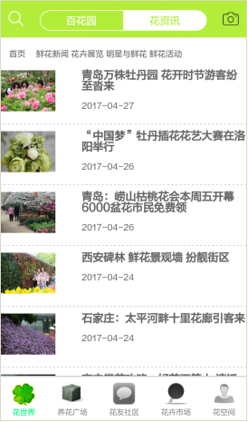
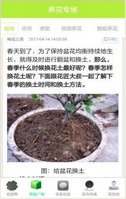
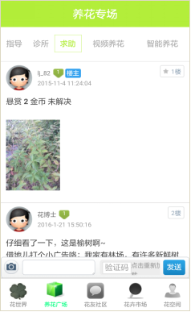
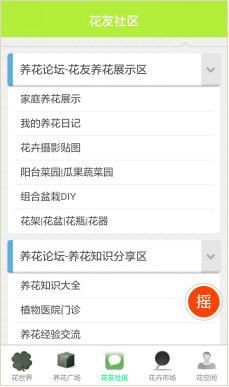
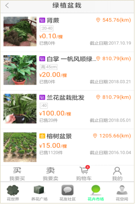

# flowerYoung —— 花漾
当年国庆假期7天，根据兴趣设计了一款 APP，为参加比赛做的一个样本，功能或细节开发做的不好，很多是嵌的现成的网站做的适配，不过能看能演示，重在idea的实现了。

## idea
“花漾”是一款为花卉爱好者打造的以居家养花为核心的实用型APP。为养花爱好者提供最全面、最方便、最舒心、最新颖的花卉种植服务。    
“花漾”，呈现一个独一无二的花卉世界，极力展现属于花卉的丰富魅力；  
“花漾”，打造一个全面立体的养花专场，为花卉种植者最大限度的解决疑难问题；  
“花漾”，提供一个新颖有趣的花友交流平台，为花卉爱好者建立社交圈充分交流；  
“花漾”，努力创造一个服务居家花卉种植、迎合现代化生活的新型APP。

## 相关环境
- 支持平台：Android
- 开发工具：eclipse with Android SDK

## 功能组成
1. 花世界——提供各种各样花的知识，包括花的图片、特点、习性、历史、文章、新闻等。
2. 养花专场——主要解决养花过程中遇到的各种问题，有养花技巧，教学视频和养花求助平台。
3. 智能养花系统——智能花盆底部安装硬件与APP客户端相结合，能够检测温度、光强、土壤湿度等花卉生长条件，并根据系统设置及时做出提醒，达到智能养花。
4. 养花交流平台——为养花爱好者提供一个相互交流、传授经验的平台，使养花经历、经验达到共享。
5. 花卉市场——主要“花漾”商店和普通的签约商店，提供花种、花苗花盆、花铲、花肥等花卉相关产品，为养花者提供一个选购平台。
6. 个人中心——主要有个人相关信息，个人花记等内容。

除主要功能板块外，还有一系列的附加小功能，如：猜花谜、关于花的小游戏、签到领花瓣等，力求为养花爱好者提供一个功能全面、新鲜有趣的养花工具。

## Authors
qiwenkaikai@qq.com

## APP展示

